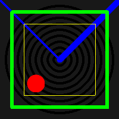
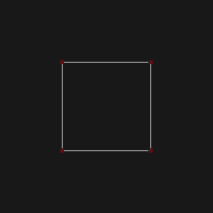
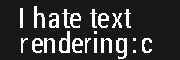
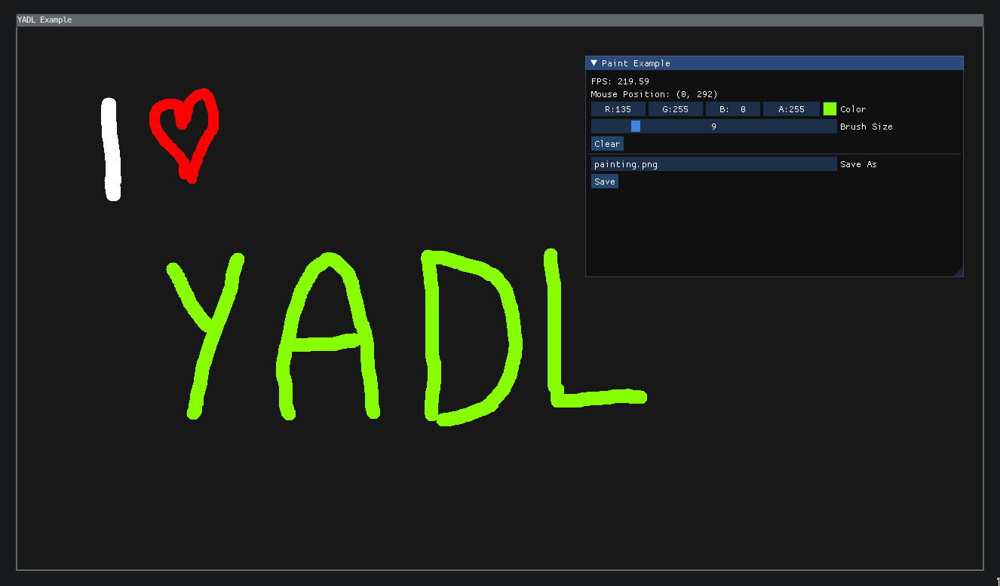

# YADL
Yet Another Drawing Library

# Use cases
- Quick prototyping (images, animations)
- Embedded devices (pure cpu rendering, no gpu required)

# Features
- Simple to use 
- Alpha blending
- Simple shapes (lines, rectangles, circles)
- Text rendering and font loading
- Loading, saving images
- Animations and export to gif
- Antialiased circles and lines
- Graphical effects (blur, grayscale, invert, blur)
- Image resizing
- and other useful stuff

# Todo
- 3d
- Texture mapping
- Multithreading

# Examples
- see [classic examples](examples/classic_examples), for examples that generate images, and [sdl examples](examples/sdl_examples) for live examples that use sdl2.

# Dependencies
- [FreeType](https://www.freetype.org/download.html) (2.13+)
- [libpng](http://www.libpng.org/pub/png/libpng.html)
- [SDL2](https://www.libsdl.org/download-2.0.php) (2.0.18+) for sdl examples
- [GLM](https://github.com/g-truc/glm) for [cube example](examples/classic_examples/cube_example.cpp)

# Used libraries
- [stb_image](https://github.com/nothings/stb/blob/master/stb_image.h)
- [stb_image_write](https://github.com/nothings/stb/blob/master/stb_image_write.h)
- [gif-h](https://github.com/charlietangora/gif-h)
- [imgui](https://github.com/ocornut/imgui) (for sdl examples)

# Assets
- [Cat photo](https://commons.wikimedia.org/wiki/File:Stray_cat_on_wall.jpg) (Public Domain), resized to 25% and converted to png.
- [Font Roboto Condensed](https://www.1001freefonts.com/roboto-condensed.font)