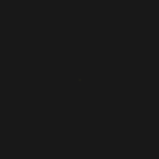
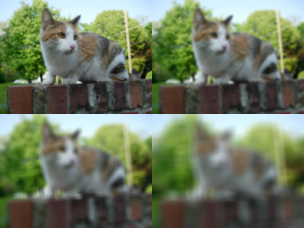
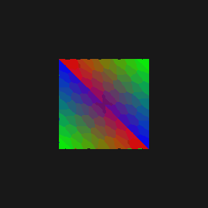

# YADL
Yet Another Drawing Library

# Use cases
- Quick prototyping (images, animations)
- Embedded devices (pure cpu rendering, no gpu required)

# Features
- Simple to use 
- Alpha blending
- Simple shapes (lines, rectangles, circles, triangles)
- Text rendering and font loading
- Loading, saving images
- Animations and export to gif
- Antialiased circles and lines
- Graphical effects (blur, grayscale, invert)
- Image resizing
- and other useful stuff

# Todo
- Fix texture mapping
- Multithreading

# Examples
- see [classic examples](examples/classic_examples), for examples that generate images, and [sdl examples](examples/sdl_examples) for live examples that use sdl2.








###### (example above uses 2 triangles and texture mapping, also logo was resized to 250x250, so it looks a bit squished. See [texture_mapping_example.cpp](examples/classic_examples/texture_mapping_example.cpp)




###### (I know about weird texture warping, but even while using perspective projection, it still looks like that.. might fix it later)


# Usage
```cpp
#include <yadl/yadl.hpp>

int main(int argc, char const *argv[])
{
    using namespace yadl;

    Canvas canvas(500, 500);
    canvas.Clear(Color::Dark);
    Context ctx(canvas);
    ctx.SetColor(Color::Red).SetPosition(canvas.GetCenterX(), canvas.GetCenterY());
    
    int radius = 150;
    shape::DrawFilledCircleAA(ctx, radius); // AA stands for antialiased

    io::SaveAsPNG("circle.png", canvas);
    return 0;
}
```
#### This code can be found in [circle_example.cpp](examples/classic_examples/readme_example.cpp) 
#### Output:


# Dependencies
- [FreeType](https://www.freetype.org/download.html) (2.13+)
- [libpng](http://www.libpng.org/pub/png/libpng.html)
- [SDL2](https://www.libsdl.org/download-2.0.php) (2.0.18+) for sdl examples
- [GLM](https://github.com/g-truc/glm) for [cube example](examples/classic_examples/cube_example.cpp)

# Used libraries
- [stb_image](https://github.com/nothings/stb/blob/master/stb_image.h)
- [stb_image_write](https://github.com/nothings/stb/blob/master/stb_image_write.h)
- [gif-h](https://github.com/charlietangora/gif-h)
- [imgui](https://github.com/ocornut/imgui) (for sdl examples)
- [tinyobjloader](https://github.com/tinyobjloader/tinyobjloader)

# Assets
- [Cat photo](https://commons.wikimedia.org/wiki/File:Stray_cat_on_wall.jpg) (Public Domain), resized to 25% and converted to png.
- [Font Roboto Condensed](https://www.1001freefonts.com/roboto-condensed.font)
- [C++ logo](https://github.com/Benio101/cpp-logo) (Public Domain) resized to 250x250px
- [Box texture](https://learnopengl.com/img/textures/container2.png)
- [Wet Floor Sign model](https://polyhaven.com/a/WetFloorSign_01)